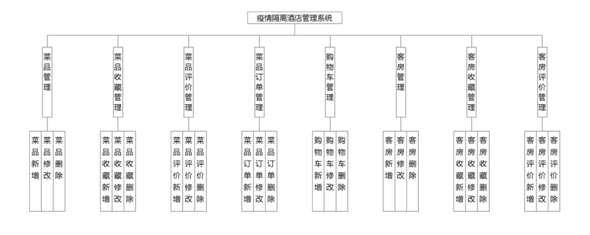
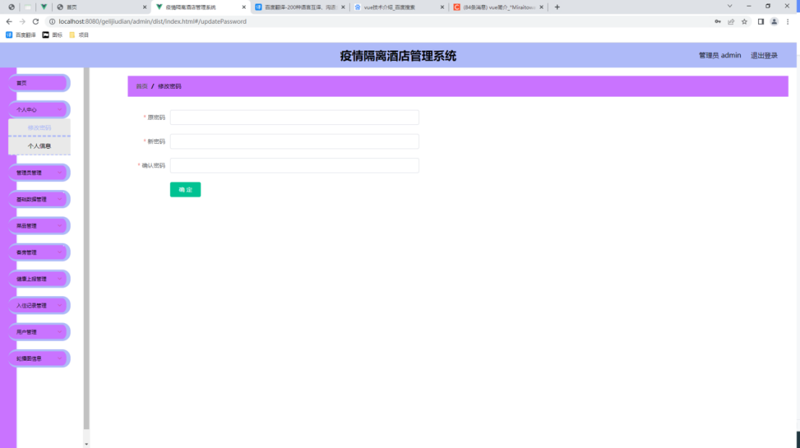
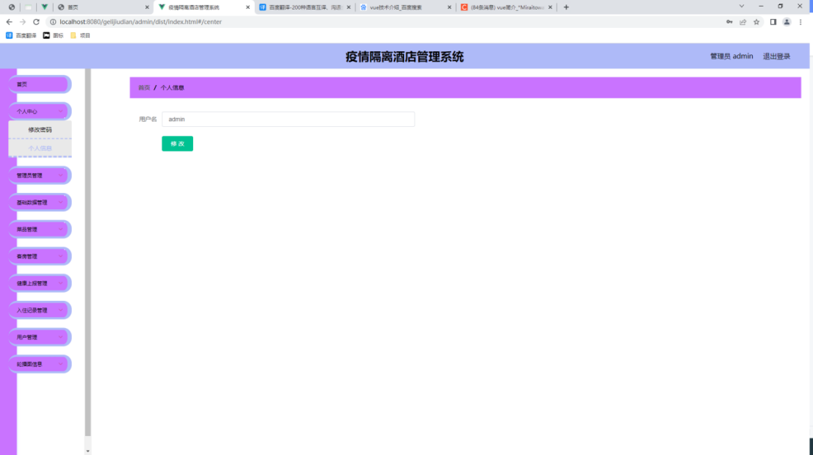
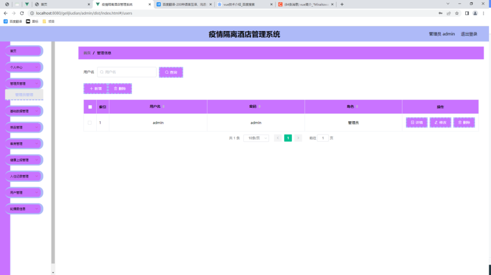
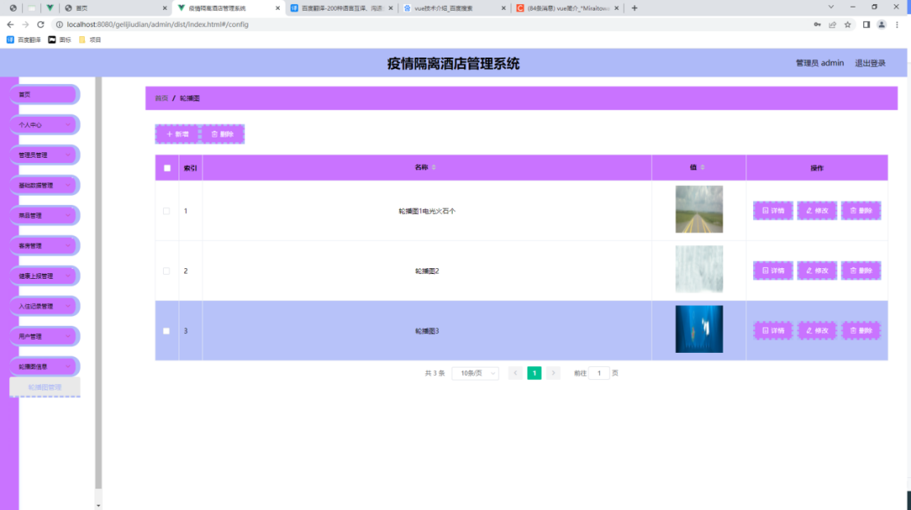
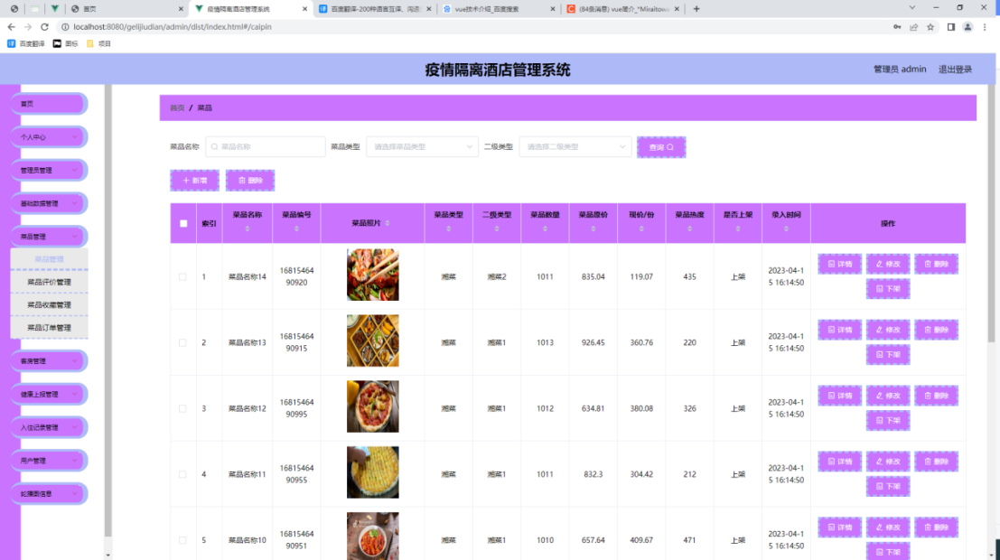
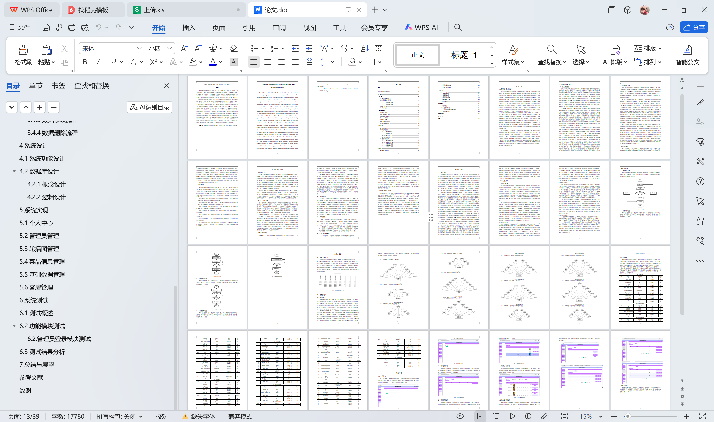

# springboot256-基于SpringBoot的疫情隔离酒店管理系统

>  博主介绍：
>  Hey，我是程序员Chaers，一个专注于计算机领域的程序员
>  十年大厂程序员全栈开发‍ 日常分享项目经验 解决技术难题与技术推荐 承接各类网站设计，小程序开发，毕设等。
>  【计算机专业课程设计，毕业设计项目，Java，微信小程序，安卓APP都可以做，不仅仅是计算机专业，其它专业都可以】

## 本项目获取地址：https://www.bishecode.com/product/252/

## 3000套系统可挑选，获取链接：https://www.bishecode.com/

### 系统架构

> 前端：html | js | css | jquery | vue
>
> 后端：springboot | mybatis
> 
> 环境：jdk1.8+ | mysql | maven

# 一、内容包括
包括有  项目源码+项目论文+数据库源码+答辩ppt+远程调试成功

# 二、运行环境

> jdk版本：1.8 及以上； ide工具：IDEA； 数据库: mysql5.7及以上；编程语言: Java

# 三、需求分析

**3.1需求分析**

在对系统进行设计之前，需要进行需求分析，即软件实现前的计划活动。需求分析阶段是设计人员在与用户交流时，将用户的描述转变成具体的需求定义的过程，即准确地理解和确认用户实际上想要实现的系统功能，由此确定系统设计的目的是什么，实现系统必须完成哪些工作，到底能够做什么。需求分析是开发周期阶段中用时最长的重要环节，贯穿于整个系统的研发过程中，需求分析的结果是实现总体功能设计的规划基础，也是实现数据库设计的信息依据，由此展开详细地功能设计，完成系统的功能设计，最后的系统测试和交付工作，又回归到需求分析中，通过对比需求分析报告规划的功能需求，是否与实际设计的系统功能一致，能否实现功能操作和数据处理，确定系统的设计是否符合规范和要求。

需求分析在软件开发周期中是耗时最长的一个环节，系统的整个设计和实现过程主要依赖于需求分析报告。调查收集出不同用户对本疫情隔离酒店管理系统的相关使用需求，由此设计相关的功能模块，从而期望实现用户满意度较高的实用型系统。这一过程是系统能否成功投入市场，也能否被用户所接受和使用的非常关键的一个步骤。相关人员将总体需求分析大致分为了三种，即业务需求分析、功能需求分析、非功能需求分析。业务需求分析对于用户在日常生活、工作上的实际需求为标准和方向，确定需要设计的相关业务事项，其是功能需求分析的基础，在本疫情隔离酒店管理系统设计过程中，主要业务需求包括菜品管理,客房管理,入住记录,健康上报管理等。功能需求分析是通过设计系统功能来实现相关的业务事项，它也是确定一个系统的设计是否具备价值的重要依据。非功能需求分析是在系统使用过程中对性能的具体要求，对功能需求的一个补充内容，也是对功能需求的一个补充内容，主要包括响应需求、安全性需求、稳定性需求、可扩展性需求等内容。非功能需求是在系统功能需求以外的其他必要的需求内容，比如说安全需求、相应需求等，它在最后投入使用阶段，起到了极其重要的作用。

本人通过现场观察、问卷调查等方式，详细地对疫情隔离酒店管理系统进行了需求分析，根据分析结果可知，疫情隔离酒店管理系统主要分为管理员和用户角色。管理员角色主要的功能需求包括个人中心管理、用户管理、房间管理,菜品管理,入住记录管理,健康上报管理等模块，管理员可以通过选择相关的功能模块，实现对相关数据的增、删、改、查等基本操作，管理相应的数据信息记录。在管理员角色功能模块设计过程中，客房是一个及其重要的功能模块，管理员可以通过选择该模块，查看、更新相关客房信息，管理相关的客房入住记录等。用户角色主要的功能需求包括首页、论坛、公告、个人中心等模块，用户可以通过选择相关的功能模块，实现相应的功能操作。在用户角色功能模块设计过程中，客房入住是一个占据重要地位的功能模块，用户可以通过选择客房，入住客房。疫情隔离酒店管理系统的研发，不仅方便了疫情隔离酒店管理的管理人员管理相关的客房入住信息，也方便了用户在线查看想要了解的疫情防控相关信息。因此，对于管理员和用户来说，设计和实现一款疫情隔离酒店管理系统，是非常具有研究的意义和实现价值的，使得管理疫情隔离酒店管理变得非常便捷，极大地满足了相关用户对疫情隔离酒店系统的使用需求。

**3.2可行性分析**

**3.2.1经济可行性**

经济可行性是决定是否研发系统的关键性因素。我们主要通过比较实际的收益和成本的方法，来确定一个系统是否具有经济可行性。在使用系统的过程中，当获得的收益大于开发的成本时，说明此系统的研发在经济上是可行的。传统的客房模式主要通过相关的工作人员以手工记录的方式，管理疫情隔离酒店管理信息记录，这种管理模式比较费时费力，管理疫情隔离酒店管理的费用也比较高，一方面疫情隔离酒店管理相关人员支付高额的管理费用，另一方面人工管理疫情隔离酒店管理信息非常容易出错，一旦出现疫情隔离酒店管理信息记录有误，则需要进行返工处理，修改的工作量非常大，极大地影响了疫情隔离酒店管理的管理。

由于本疫情隔离酒店管理系统的开发使用的技术基本上是开源的，获得技术上的支持是没有多少问题的，在软件实现方面所花费的成本是很低的，甚至不需要花费成本。研发系统的成本主要是来自调研、硬件和技术人员等方面。如果系统中需要存储的数据量不是很大，仅需要配置一台普通的服务器，即可满足相关需求。如果需要存储的数据量很大，则需要配置一台具有独立功能的服务器，比如管理数据库需要单独的数据库服务器，负责接入网站需要web服务器等等，但是一台服务器的价格是比较贵的。考虑到数据量和成本，我们使用小型集群服务器，这样既可以充分利用相关的资源，又可以让系统正常访问服务器。疫情隔离酒店管理系统的设计，既可以节约客房成本，也可以保证相关的疫情隔离酒店管理信息不易出错，所以研发本系统是具备经济可行性的。

**3.2.2技术可行性**

本疫情隔离酒店管理系统使用Java语言编码设计相关的功能模块，MySQL数据库创建和存储数据表格，VUE技术设计网站页面，并且在IDEA开发环境中，编写和运行相关的Java代码，然后在MySQL数据库中设计与系统有关的数据表格，接着通过使用连接代码完成与MySQL数据库的搭建工作，再通过使用开发环境中的Tomcat插件，完成与Tomcat服务器的发布工作，并且通过与Tomcat服务器的交互行为可以实现代码调试工作，最后用户在浏览器中成功的访问和使用本系统。Java语言具有跨平台性，本系统主要通过Java语言进行编码实现的，所以本系统可以支持在多个操作系统或者多个浏览器上运行和使用[14]。MySQL数据库是可以被免费使用的，并且MySQL数据库的日常运行和维护工作比较简单，这样有利于降低本系统的开发成本[15]。VUE技术具有独立性好，实用性高的特点，使用VUE技术设计系统页面可以与服务器完成可靠有效的交互工作[16]。在学校期间，本人已经学习和掌握了Java语言、MySQL数据库、VUE技术等相关的技术相关知识以及用法，因此在技术可行性方面，本系统是可以实现被设计与实现的。

**3.2.3操作可行性**

本疫情隔离酒店管理系统所采用网络结构是B/S模式，对于开发人员来说，可以直接复用相关的代码，或者稍微对原代码进行修改，使得其满足于本系统的相关需求，如此便可大大节约了开发时间，在最优最短的时间内完成对系统的设计。对于用户来说，如果还如传统的C/S模式一般，只有下载才可使用相关的系统，就非常不方便了，这也极大的限制了一部分用户的使用。现在，本系统采用的是新型的模式设计，用户通过浏览器使用本系统。并且，用户可以根据自身的工作需要，选择相关的菜单按钮操作本系统。在系统的一些功能模块中，本人还添加了相关的使用提示信息，方便用户更好更快的了解和使用本系统。

为了可以让用户更好地体验本系统，本人在windows操作系统平台上，以系统的需求分析为基础，使用相关的开发工具，对疫情隔离酒店管理系统进行研发。用户在浏览器中输入正确的账户信息，对疫情隔离酒店管理系统进行访问，选择使用下拉式菜单的方式，创建交互性强、界面美观友好的疫情隔离酒店管理系统，简化用户对系统的操作和使用。用户可以通过点击相关的功能按钮，选择修改个人信息，查看最新的疫情隔离酒店管理信息，查看推荐的论坛、公告等操作。由此可见，本系统的使用步骤是非常简单，因此，本系统的设计和实现是具备操作可行性的。

**3.2.4法律可行性**

本疫情隔离酒店管理系统是本人为了完成毕业设计而进行设计和实现的，一般是不用于商业使用的，即不投入市场产生收益，所以无论是从系统的实现条件，还是从系统设计的最终目的上来看，系统的研发是符合现实社会的要求和规范的。本人在开发过程中一直按照正规流程进行Java语言编码设计，MySQL数据库有免费版本可供设计人员使用，而且MySQL是开放源码的关系型数据库，技术人员可以在相关的MySQL酒店交流平台上查看相关的代码，以及寻求专业人员的帮助，所以在系统功能设计和数据库设计上使用的关键技术也是具备合法性。根据系统的实现条件、设计目的、使用的关键技术等内容来看，所以设计本系统具备法律可行性。

# 四、功能模块

本疫情隔离酒店管理系统主要通过使用Java语言编码设计系统功能，MySQL数据库管理数据，VUE技术设计简洁的、友好的网址页面，然后在IDEA开发平台中，编写相关的Java代码文件，接着通过连接语言完成与数据库的搭建工作，再通过平台提供的Tomcat插件完成信息的交互，最后在浏览器中打开系统网址便可使用本系统。本系统的使用角色可以被分为用户和管理员，用户具有注册、评价信息等功能，管理员具有修改、管理信息等功能，系统总体功能设计图如图。

# 五、效果图展示【部分效果图】

图5-1修改密码界面【个人中心模块主要负责存管有关于个人的数据信息记录，用户具有查询详细的个人信息资料，根据个人的实际情况及时进行信息变更处理等功能，修改密码界面设计如图5-1所示】

图5-2个人信息界面【个人信息界面设计如图5-2所示】

图5-3管理员管理界面【管理员管理模块主要负责存管有关于管理员的数据信息记录，管理用户具有查询详细的管理员基础信息，根据管理员的实际情况及时进行信息变更处理等功能，管理员管理的界面设计如图5-3所示。】

图5-4轮播图管理界面【轮播图管理模块主要负责存管有关于轮播图的数据信息记录，用户具有查询详细的轮播图信息，根据轮播图的实际情况及时进行信息变更处理等功能，轮播图管理界面设计如图5-4所示。】

图5-5菜品信息管理界面【菜品信息管理模块主要负责存管有关于菜品的数据信息记录，管理员具有查询详细的菜品信息，根据菜品的实际情况及时进行信息变更处理等功能，菜品信息管理界面设计如图5-5所示。】

 <b>完整文章</b>
 
 
 

## 本项目获取地址：https://www.bishecode.com/product/252/

## 3000套系统可挑选，获取链接：https://www.bishecode.com/

